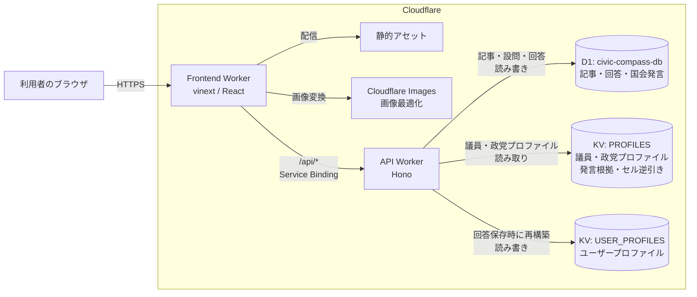
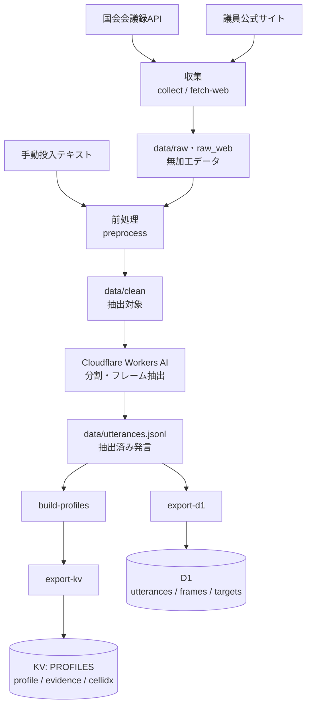

# civic-compass

日々の政治ニュースへの関心と意見を記録し、政策への単純な賛否ではなく、発言の「正当化の論理」から自分と考え方が近い政治家・政党を探すスマートフォン向けWebアプリです。

記事、設問、回答、国会発言はCloudflare D1に保存し、議員・政党プロファイルとユーザープロファイルはCloudflare KVに保存します。フロントエンドはデータストアへ直接接続せず、すべてのデータをAPI Worker経由で取得します。

> 現在はプロトタイプです。記事はデモ用です。初回に名前だけを登録し、以後はブラウザCookieでユーザーを識別します。詳しくは[現在の制約](#現在の制約)を参照してください。

## 主な機能

- 政治ニュースの一覧・詳細表示
- 記事ごとの争点に対する意見、関心度、自由記述の保存
- 保存直後に、その論点に近い立場・異なる立場の議員と発言根拠を表示
- 回答から、自分が重視する考え方の傾向を集計
- 議員・政党との総合マッチ度、共通点、相違点、出典を表示
- 政治家個人ページへの外部リンク

マッチングでは `frame × target × role` を1つの「セル」として扱います。例えば同じ政策に賛成していても、「個人の自由」を理由にする場合と「公平性」を理由にする場合を別の考え方として捉えます。設計の背景は[`docs/design-constraints.md`](./docs/design-constraints.md)を参照してください。

## システム構成

### 実行時構成



- Frontend WorkerはvinextでビルドしたReactアプリ、静的アセット、画像最適化を提供します。
- `/api/*` は公開URLを経由せず、Cloudflare Service BindingでAPI Workerへ転送します。
- API Workerは`workers.dev`へ公開せず、D1とKVのバインディングはAPI Workerだけが保持します。
- 回答はまずD1へ保存され、その回答全体からユーザープロファイルを再計算して`USER_PROFILES`へ保存されます。
- 総合マッチでは`USER_PROFILES`と`PROFILES`を比較し、上位議員についてのみ発言根拠を追加取得します。

### 議員プロファイル生成パイプライン

議員側のデータはリクエスト時にLLMで生成せず、ローカルのバッチスクリプトで事前に構築します。現在、この処理はCronではなく人が手動で実行します。



LLMには価値軸の連続スコアを直接生成させず、離散ラベルと根拠箇所を抽出させます。引用が原文と一致しない結果は破棄し、スコアとプロファイルは後段のコードで決定的に集計します。詳しい手順は[`scripts/kokkai/README.md`](./scripts/kokkai/README.md)を参照してください。

### ローカル開発時の通信

ローカルではFrontend WorkerとAPI Workerを別プロセスで起動します。ブラウザからの`/api/*`はVite proxyがAPIの8000番ポートへ転送し、本番と同じ相対URLで動作します。D1とKVのローカル状態はリポジトリ直下の`.wrangler/state`で共有します。

```text
ブラウザ :3000 → Vite / Frontend Worker → /api/* proxy → API Worker :8000 → ローカルD1・KV
```

## リポジトリ構成

npm workspacesによるモノレポです。

```text
civic-compass/
├── frontend/              # vinext / Reactの画面とFrontend Worker
│   ├── app/               # 画面、UIコンポーネント、スタイル
│   ├── lib/               # APIクライアントと画面用の型
│   ├── worker/            # Service Binding・画像最適化を扱うエントリーポイント
│   └── tests/             # ビルド結果とUIロジックのテスト
├── api/                   # Honoで実装したAPI Worker
│   ├── src/routes/        # エンドポイント単位のルーター
│   ├── src/profile-match.ts
│   ├── src/user-profile.ts
│   └── tests/
├── db/                    # DrizzleのD1スキーマとマイグレーション
├── shared/                # 語彙、スコア計算、共有データ型
├── scripts/
│   ├── kokkai/            # 国会発言の収集・抽出・プロファイル生成
│   └── *.mjs              # デプロイ検証、D1移行、スモークテスト
├── docs/                  # データ仕様、設計制約、マッチ計算の説明
└── .github/workflows/     # main更新時の検証・デプロイ
```

`shared`は語彙とスコア計算の唯一の正です。`db`はD1スキーマを提供し、API WorkerだけがDrizzle経由で利用します。

## 使用技術

| 領域 | 技術 |
| --- | --- |
| 画面 | React 19 / vinext（Next.js互換）/ TypeScript / Tailwind CSS / Lucide React |
| API | Cloudflare Workers / Hono / TypeScript |
| データ | Cloudflare D1 / Cloudflare KV / Drizzle ORM |
| 画像 | Cloudflare Images / Workers Static Assets |
| データ抽出 | Cloudflare Workers AI / Zod |
| 開発・デプロイ | npm workspaces / Vite / Wrangler / GitHub Actions |

## データの役割

| 保存先 | 主なデータ | 性質 |
| --- | --- | --- |
| D1 `civic-compass-db` | 記事、設問、ユーザー、回答、選択肢、抽出済み国会発言 | 元データ。回答は答え直し時に更新、国会発言は原則追記 |
| KV `PROFILES` | 議員・政党プロファイル、発言根拠、セル逆引き | 国会発言から再生成できる派生データ。APIからは読み取り専用 |
| KV `USER_PROFILES` | ユーザーごとの考え方プロファイル | D1の回答から再生成できる派生データ |
| `data/` | 収集結果、前処理結果、LLM抽出結果、KV投入データ | `.gitignore`対象。データ構築時だけ使用 |

KVのキーや各データ形式は[`docs/data-reference.md`](./docs/data-reference.md)、マッチ計算は[`docs/implementing-match-api.md`](./docs/implementing-match-api.md)を参照してください。

## API

フロントエンドは[`frontend/lib/api.ts`](./frontend/lib/api.ts)から、次のAPIを相対URLで呼び出します。

| メソッド・パス | 用途 |
| --- | --- |
| `GET /api/articles` | 記事、設問、選択肢を取得 |
| `GET /api/answers` | 現在のユーザーの保存済み回答を取得 |
| `POST /api/answers` | 回答をD1へ保存し、ユーザープロファイルをKVへ再構築 |
| `GET /api/session` | Cookieに対応する現在のユーザーを確認 |
| `POST /api/session` | 名前からユーザーを作成し、セッションCookieを発行 |
| `GET /api/perspectives/:articleId` | 保存した記事について、議員の立場と発言根拠を取得 |
| `GET /api/user-profile` | ユーザーが重視する上位3セルを取得 |
| `GET /api/matches/profile` | 議員・政党との総合マッチ結果を取得 |
| `GET /api/health` | APIとD1の疎通確認 |
| `GET /api/example` | 新規ルート実装用の雛形 |
| `GET /api/matches/:articleId` | 旧画面向けのデモ用マッチ結果。新しい画面は`perspectives`を使用 |

APIルーターは[`api/src/index.ts`](./api/src/index.ts)で登録します。各ルートは`api/src/routes/`に分け、Wranglerのバインディングは[`api/src/bindings.ts`](./api/src/bindings.ts)で型付けします。

## 動作環境

- Node.js 22.20.0（`.nvmrc`とCIで固定）
- npm
- ローカルの議員プロファイルを構築・投入する場合はWranglerでCloudflareへログイン

## セットアップ

リポジトリ直下で実行します。

```bash
npm install
npm run db:migrate
npm run dev
```

| サービス | URL | 説明 |
| --- | --- | --- |
| フロントエンド | http://localhost:3000 | ブラウザで開く画面 |
| API | http://localhost:8000 | `wrangler dev`で動くAPI Worker |

`http://localhost:8000/api/health`が`{"status":"ok","database":"connected"}`を返せば、APIからローカルD1まで接続できています。

初期マイグレーションにはデモ記事、設問、テストユーザーが含まれます。議員との比較に使う`PROFILES`のローカルデータは含まれないため、必要な場合は[`scripts/README.md`](./scripts/README.md)と[`scripts/kokkai/README.md`](./scripts/kokkai/README.md)に従って構築・投入してください。

片方だけ起動する場合は次を使用します。

```bash
npm run dev:frontend
npm run dev:api
```

APIのポートを変更する場合は、[`api/wrangler.jsonc`](./api/wrangler.jsonc)の`dev.port`と[`frontend/vite.config.ts`](./frontend/vite.config.ts)のproxy設定を同時に変更してください。

## よく使うコマンド

すべてリポジトリ直下で実行します。

| コマンド | 説明 |
| --- | --- |
| `npm run dev` | フロントエンドとAPIを同時に起動 |
| `npm run build` | フロントエンドとAPIの本番ビルドを確認 |
| `npm run lint` | リポジトリ全体をESLintで検査 |
| `npm run lint:fix` | ESLintで自動修正できる問題を修正 |
| `npm run test` | APIとフロントエンドのテストを実行 |
| `npm run typecheck` | 全ワークスペースの型とWrangler生成型を検査 |
| `npm run cf:typegen` | Wrangler設定からバインディング型を再生成 |
| `npm run db:generate` | D1スキーマの変更からマイグレーションSQLを生成 |
| `npm run db:migrate` | ローカルD1へマイグレーションを適用 |
| `npm run db:migrate:remote` | Cloudflare上のD1へマイグレーションを適用 |

特定のワークスペースだけを操作する場合は`-w`を指定します。

```bash
npm run <script> -w frontend
npm run <script> -w api
npm install <package> -w api
```

## D1スキーマの変更

テーブル定義は[`db/src/schema.ts`](./db/src/schema.ts)に集約しています。

```bash
# db/src/schema.tsを編集した後にSQLを生成
npm run db:generate

# ローカルD1へ適用
npm run db:migrate
```

生成された`db/migrations/*.sql`はコミットしてください。本番への適用はGitHub Actionsがデプロイ前に行います。

ローカルD1を直接確認する例です。

```bash
npm exec -w api -- wrangler d1 execute DB --local --persist-to ../.wrangler/state \
  --command "SELECT name FROM sqlite_master WHERE type='table';"
```

## デプロイ

`main`へのpushまたは手動実行で[`.github/workflows/deploy.yml`](./.github/workflows/deploy.yml)が起動します。

1. lint、型検査、テスト、APIビルド
2. Cloudflare設定の検証
3. D1マイグレーション
4. API Workerのデプロイ
5. Frontend Workerのデプロイ
6. 公開URLが設定されている場合はスモークテスト

GitHubリポジトリの`Settings > Secrets and variables > Actions`に次を登録します。

| 種別 | 名前 | 内容 |
| --- | --- | --- |
| Secret | `CLOUDFLARE_ACCOUNT_ID` | デプロイ先CloudflareアカウントID |
| Secret | `CLOUDFLARE_API_TOKEN` | 対象アカウントに限定したWorkers編集用APIトークン |
| Variable（任意） | `CIVIC_COMPASS_PUBLIC_URL` | Frontend Workerの公開URL。設定時のみスモークテストを実行 |

API Workerは`workers.dev`へ公開せず、Frontend Workerの`API` Service Bindingからのみ呼び出します。手動で同じ順序を実行する場合は次を使用します。

```bash
node scripts/migrate-d1-remote.mjs
npm run deploy:api
npm run deploy:frontend
```

## 現在の制約

- ログイン、アカウント切り替え、Cookie削除後のデータ復旧は未実装です。Cookieを削除すると、次回は新しいユーザーとして登録されます。
- 記事本文と設問はプロトタイプ用のデモデータです。
- 自由記述はD1へ保存しますが、自由記述からのフレーム抽出は未実装です。現在のユーザープロファイルは選択式の回答から作ります。
- `GET /api/matches/:articleId`は旧画面向けのデモ値です。現行画面の保存直後表示は`GET /api/perspectives/:articleId`を使用します。
- 議員プロファイルの対象は[`scripts/kokkai/politicians.json`](./scripts/kokkai/politicians.json)で管理する現職15人です。
- 議員データの差分収集、LLM抽出、D1・KVへの投入は自動実行されず、現在はローカルスクリプトを手動で実行します。
- R2、AI Gateway、Cron Triggers、Turnstile、Secrets Storeは設計候補ですが、現在のWrangler構成には含まれていません。

政治的判断に関わる情報を扱うため、画面上では投票の推奨ではないことを明示し、マッチ理由に出典を付けます。運用に進む際は、認証、プライバシーポリシー、データ更新日、バッチ自動化、障害時の再構築手順を整備する必要があります。
